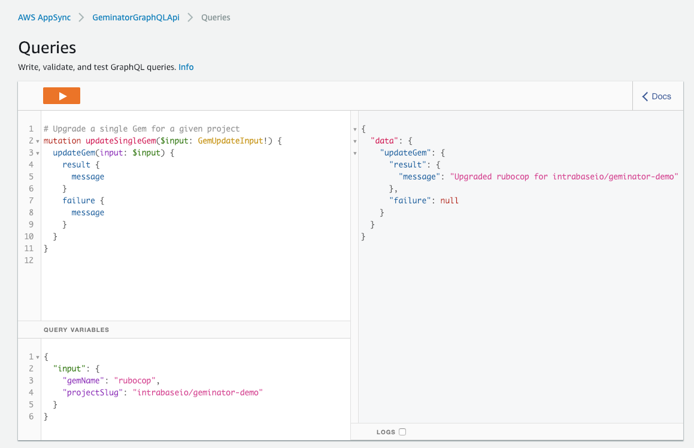

# Geminator

Run `bundle lock --update=<gem> --conservative` in an AWS Lambda and commit it back on a dedicated branch.

- Provides an AWS Lambda Layer to add Bundler
- Creates branch `geminator` if not present
- Runs bundle lock update for provided gem
- Creates commit when changes are present
- Works with Github / Gitlab

NB: Doesn't work properly with [Bundler Ruby Version](https://bundler.io/v1.12/gemfile_ruby.html), since AWS Lambda just has Ruby 2.5.0 as runtime right now.


## Getting started

Requires:

- AWS CLI
- AWS CDK
- Docker
- Nodejs
- Typescript

```
npm install -g aws-cdk
aws ssm put-parameter --name /CDK/GithubToken --type String --overwrite --value <GITHUB_ACCESS_TOKEN>
yarn install
yarn run build-layer
yarn run build
cdk deploy
```

## GraphQL API

### Queries

There's an AppSync API which allows querying for outdated and upgradeable gems.


### Mutations

And then there's a mutation to upgrade a single Gem for a given repository.



## Configuration

### Lambda Envs

- `WORKING_BRANCH` (defaults to `geminator`)
- `GIT_PROVIDER` (either `github` or `gitlab`)
- `PRIVATE_TOKEN` (private access token passed in via the AWS Parameter Store. Expected under `/CDK/GitlabToken` or `/CDK/GithubToken`)

# Useful commands

- `npm run build` compile typescript to js
- `npm run watch` watch for changes and compile
- `cdk deploy` deploy this stack to your default AWS account/region
- `cdk diff` compare deployed stack with current state
- `cdk synth` emits the synthesized CloudFormation template
